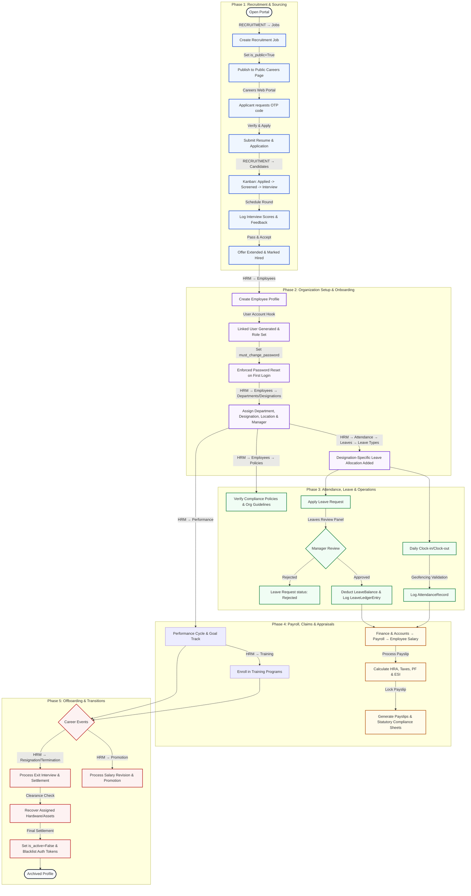

# 📖 Premium HRMS End-to-End Enterprise Workflow Guide

This guide details the complete employee lifecycle inside the HRMS platform, mapped to the exact sidebar navigation hierarchy of the application. Use this document to trace transactions, navigate the portal, verify operations, and run manual checks.

---

## 🗺️ Sidebar Navigation Directory

| Main Category | Primary Module | Sub-Module | Target View / Dashboard |
| :--- | :--- | :--- | :--- |
| **Main Menu** | 📊 Dashboard | — | `Admin Dashboard`, `Employee Dashboard` |
| | 📱 Applications | — | `Chat`, `Calls`, `Calendar`, `Email`, `To Do`, `Notes`, `File Manager`, `Kanban`, `Invoices` |
| | 👑 Super Admin | — | `Dashboard`, `Companies`, `Subscriptions`, `Packages`, `Domain`, `Purchase Transaction` |
| **HRM** | 👥 Employees | — | `Employees List`, `Employees Grid`, `Employees Details` |
| | | 🏢 Org Setup | `Departments`, `Designations`, `Policies`, `Org Chart` |
| | 🎫 Tickets | — | `Tickets List`, `Tickets Detail` |
| | 📅 Holidays | — | `Holidays Calendar` |
| | ⏱️ Attendance | 🍃 Leaves | `Leaves (Admin)`, `Leaves (Employee)`, `Leave Types`, `Leave Settings` |
| | | 🕒 Shifts | `Attendance (Admin)`, `Attendance (Employee)`, `Timesheet`, `Shift & Schedule`, `Overtime` |
| | 🎯 Performance | — | `Performance Indicator`, `Performance Review`, `Performance Appraisal`, `Goal List`, `Goal Type` |
| | 🎓 Training | — | `Training List`, `Trainers`, `Training Type` |
| | 📢 Career Events | — | `Promotion`, `Resignation`, `Termination` |
| | 💵 Reimbursements | — | `Expense Claims`, `Claims Approval` |
| **RECRUITMENT**| 💼 Jobs | — | `Recruitment Jobs Board`, `Public Careers Portal` |
| | 👤 Candidates | — | `Candidates Stage Kanban`, `Interview Scheduling` |
| | 🔗 Referrals | — | `Employee Referrals List` |
| **Finance & Accounts**| 🛍️ Sales | — | `Estimates`, `Invoices`, `Payments`, `Expenses`, `Provident Fund`, `Taxes` |
| | 💰 Accounting | — | `Categories`, `Budgets`, `Budget Expenses`, `Budget Revenues` |
| | 💸 Payroll | — | `Salary Components`, `Employee Salary`, `Payslips`, `Statutory Reports` |
| **Administration**| 🖥️ Assets | — | `Asset List`, `Asset Categories`, `Asset Assignments` |

---

## 📊 Visual Lifecycle Flowchart

---

## 🛠️ Step-by-Step Lifecycle Guide

### 🎬 Phase 1: Sourcing & Sift
1. **Define Vacancies:** Go to **RECRUITMENT** → **Jobs**. Click **Add Job**, fill in requirements, experience level, salary range, and set `is_public` to **True**.
2. **Sourcing Application:** Open the public URL `/careers/jobs`. The applicant inputs their email to request a secure OTP, enters it, logs in, fills in their details, uploads a resume, and submits.
3. **Pipeline Review:** Go to **RECRUITMENT** → **Candidates**. Drag applicants through the Kanban pipeline from `Applied` to `Screening` and `Interview`.
4. **Log Evaluation:** Inside the candidate's card, click **Interviews** to log panel interview feedback, rate their skills, and save recommendations. Mark the candidate as **Hired/Joined**.

---

### 🏢 Phase 2: Org Setup & Profile Provisioning
1. **Department Setup:** Go to **HRM** → **Employees** → **Departments**. Click **Add Department** to create business divisions (e.g., `Quality Assurance`).
2. **Designation Setup:** Go to **HRM** → **Employees** → **Designations**. Add designations (e.g., `Lead QA Engineer`) and link them to their respective departments.
3. **Onboarding Profiles:** Go to **HRM** → **Employees** → **Employees List**. Click **Add Employee** and fill in details (email, joining date, department, designation, salary).
4. **Auto-Credential Sync:** When the employee is saved, the backend automatically generates a secure `User` account (`first_name.last_name`) and marks `must_change_password` to `True`.

---

### 📅 Phase 3: Active Lifecycle Operations
1. **Leave Policy Assignment:** Go to **HRM** → **Attendance** → **Leaves** → **Leave Types**. Click **Add Leave Policy**, select the target Designation, and click **+** to add multiple leave rules (e.g., CL - 8 days, SL - 6 days). Saved rules automatically initialize `LeaveBalance` records for employees matching that designation.
2. **Leave Request:** The employee logs in, navigates to **HRM** → **Attendance** → **Leaves** → **Leaves (Employee)**, and clicks **Apply Leave**.
3. **HR Review & Approval:** Go to **HRM** → **Attendance** → **Leaves** → **Leaves (Admin)**. Click **Review** on the request. The modal displays the **Employee Leave Summary** panel (joining date, days requested, remaining balances per type). Click **Approve**. The system automatically updates `LeaveBalance` and logs a transaction in the **Ledger History**.
4. **Compliance Guidelines:** Go to **HRM** → **Employees** → **Policies**. Click **Add Policy** to upload handbook guidelines and compliance documents.

---

### 🕒 Phase 4: Shifts & Time Tracking
1. **Shift Definitions:** Go to **HRM** → **Attendance** → **Shift & Schedule**. Define office hours, break times, and grace periods.
2. **Attendance Log:** Go to **HRM** → **Attendance** → **Attendance (Employee)** to clock-in/clock-out. The platform validates geofenced location coordinates before logging the check-in.
3. **Timesheet logs:** Go to **HRM** → **Attendance** → **Timesheet** to submit daily task sheets. Manager approval locks task logs.

---

### 🎓 Phase 5: Learning, Development & Performance Appraisal
1. **Training Calendar:** Go to **HRM** → **Training**. Click **Training List** → **Add Program** to create courses. Click **Trainers** to add external instructors. Use **Training Type** to classify modules.
2. **Review Cycles:** Go to **HRM** → **Performance**. Use **Goal List** and **Goal Type** to set KPIs. Click **Performance Review** to submit self-reviews, manager evaluations, and peer feedback.

---

### 💸 Phase 6: Financials & Payroll
1. **Payroll Components:** Go to **Finance & Accounts** → **Payroll** → **Salary Components**. Click **Add Salary Component** to define allowances (earnings) and deductions (taxes, PF, ESI).
2. **Monthly Payroll:** Go to **Finance & Accounts** → **Payroll** → **Employee Salary**. Select the month and year, click **Process Payroll**, compute bonuses, arrears, or unpaid leaves, and click **Generate Draft**.
3. **Payslips & Compliance:** Go to **Finance & Accounts** → **Payroll** → **Payslips** to review payslips, lock them, and download print-ready PDFs. Use the statutory report module to export PF Challan and ESI reports.

---

### 🚀 Phase 7: Transitions & Offboarding
1. **Promotions:** Go to **HRM** → **Promotion** to log salary revisions, role transfers, and designation changes.
2. **Reimbursements:** Go to **HRM** → **Reimbursements** → **Expense Claims** to submit expense receipts. Go to **Claims Approval** to review and pay out claims.
3. **Separation & Exit:** Go to **HRM** → **Resignation** (voluntary) or **Termination** (involuntary) to initiate exit tasks. The system automatically launches an exit checklist, recovers assigned hardware, calculates final settlements, and marks the employee's profile status as `is_active = False` in the database.

---

## 🔍 Module Verification Mapping

| Module | Navigation Path | API Endpoint | DB Model |
| :--- | :--- | :--- | :--- |
| **Dashboard** | Main Menu → Dashboard → Admin Dashboard | `GET /api/dashboard/admin/` | `AuditLog` / Summary Metrics |
| **Employee Registry**| HRM → Employees → Employees List | `GET/POST /api/employees/` | `employees.Employee` |
| **Departments** | HRM → Employees → Departments | `GET/POST /api/departments/` | `employees.Department` |
| **Designations** | HRM → Employees → Designations | `GET/POST /api/designations/` | `employees.Designation` |
| **Policies** | HRM → Employees → Policies | `GET/POST /api/policies/` | `employees.Policy` |
| **Leave Register** | HRM → Attendance → Leaves → Leaves (Admin) | `GET/PUT /api/data/leave-employee/` | `coredata.Resource` (`leave-employee`) |
| **Leave Policy** | HRM → Attendance → Leaves → Leave Types | `GET/POST /api/data/leave-types/` | `coredata.Resource` (`leave-types`) |
| **Leave Balances** | HRM → Attendance → Leaves → Leaves (Admin) | `GET /api/leave-balances/` | `coredata.LeaveBalance` |
| **Holidays** | HRM → Holidays | `GET/POST /api/data/holidays/` | `coredata.Resource` (`holidays`) |
| **Attendance** | HRM → Attendance → Attendance (Admin) | `GET/POST /api/attendance-records/` | `coredata.AttendanceRecord` |
| **Shift Schedules** | HRM → Attendance → Shift & Schedule | `GET/POST /api/shift-definitions/` | `coredata.ShiftDefinition` |
| **Jobs Board** | RECRUITMENT → Jobs | `GET/POST /api/recruitment/jobs/` | `coredata.RecruitmentJob` |
| **Public Jobs Portal**| Careers Web Page (`/careers/jobs`) | `GET /api/public/jobs/` | `coredata.RecruitmentJob` |
| **Candidates** | RECRUITMENT → Candidates | `GET/POST /api/recruitment/candidates/`| `coredata.RecruitmentCandidate` |
| **Salary Elements** | Finance & Accounts → Payroll → Salary Components| `GET/POST /api/salary-components/` | `payroll.SalaryComponent` |
| **Monthly Payslip** | Finance & Accounts → Payroll → Employee Salary | `GET/POST /api/employee-payroll/` | `payroll.EmployeePayroll` |
| **Assets Manager** | Administration → Assets → Assets | `GET/POST /api/asset-assignments/` | `coredata.AssetAssignment` |
